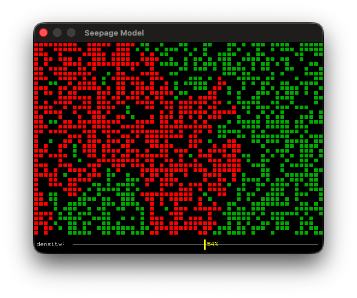

# hop

A compact interpreter for the [Hope](https://en.wikipedia.org/wiki/Hope_(programming_language)) functional programming language, implemented in a single C file.

## Features

- **Pattern matching** with nested pairs, lists, and wildcards
- **Lazy evaluation** enabling infinite data structures
- **Higher-order functions** — functions are first-class values
- **Sections** — operators as functions: `(+)`, `(*)`, `(<)`, ...
- **Module system** — `uses lib;` imports definitions
- **Formatted output** — `write` with `%d`, `%s`, `%v`, ...
- **Standard library** — folds, filters, string utilities, infinite sequences
- **Math built-ins** — `sin`, `cos`, `sqrt`, `pi`, `exp`, `log`, `pow`, `floor`, `ceil`, `fabs`, `atan2`, ... (C `math.h`, always available)
- **Random built-ins** — `rand 0` (C `arc4random()`), `srand seed` (C `srand()`)
- **Graphics** — window, pixel, line, circle, text drawing via [fenster.h](https://github.com/zserge/fenster)
- **Audio** — beep sound effects via [fenster_audio.h](https://github.com/zserge/fenster)
- **Immutable arrays** — O(1) random access with `array`, `aget`, `aset`, `amap`, `tabulate`
- **Garbage collection** — conservative mark-sweep GC for long-running programs



## Quick Start

```sh
make                              # builds with fenster.h GUI support
./hop examples/basic.hop     # text-only program
./hop examples/g_life.hop    # Game of Life animation
./hop examples/g_ball.hop    # bouncing ball animation
./hop examples/g_pixel.hop   # noise pixel animation
```

## A Taste of Hope

**Factorial:**

```hope
fun fact 0 = 1;
--- fact n = n * fact(n - 1);

fact 10;    ! 3628800
```

**Quicksort:**

```hope
fun qsort [] = [];
--- qsort (pivot :: xs) = qsort lesser <> [pivot] <> qsort greater
    where greater = [x | x <- xs, x > pivot]
    where lesser  = [x | x <- xs, x <= pivot];

qsort [3, 1, 4, 1, 5, 9, 2, 6];
! [1, 1, 2, 3, 4, 5, 6, 9]
```

**Infinite primes (Sieve of Eratosthenes):**

```hope
fun from n = n :: from(n + 1);

fun remove(p, []) = [];
--- remove(p, x :: xs) =
    if x mod p == 0 then remove(p, xs)
    else x :: remove(p, xs);

fun sieve (p :: xs) = p :: sieve(remove(p, xs));

front(10, sieve(from 2));
! [2, 3, 5, 7, 11, 13, 17, 19, 23, 29]
```

**Fibonacci via self-referencing lazy list:**

```hope
front(10, fibs)
    whererec fibs = 0 :: 1 :: map (+) (fibs || tail fibs);
! [0, 1, 1, 2, 3, 5, 8, 13, 21, 34]
```

**Pascal's triangle:**

```hope
fun nextrow row = map (+) ((0 :: row) || (row <> [0]));

front(5, rows) whererec rows = [1] :: map nextrow rows;
! [[1], [1, 1], [1, 2, 1], [1, 3, 3, 1], [1, 4, 6, 4, 1]]
```

## Language Overview

### Data Types

| Type | Examples |
|------|---------|
| Number | `42`, `3.14`, `-5` |
| Character | `'A'` (= 65), `'\n'` |
| String | `"Hello"` (= list of char codes) |
| List | `[1, 2, 3]`, `1 :: 2 :: []` |
| Pair | `(1, 2)`, `(a, (b, c))` |
| Array | `array [1,2,3]` → `[|1, 2, 3|]`, O(1) access |
| Function | first-class, passed to `map`, `foldr`, etc. |

### Operators (by precedence, high to low)

| Operators | Description |
|-----------|-------------|
| `f x` | Function application |
| `-x` `not x` | Unary negation, boolean NOT |
| `*` `/` `mod` | Multiplicative |
| `+` `-` | Additive |
| `..` `\|\|` | Range, zip |
| `<>` | List append |
| `==` `!=` `<` `>` `<=` `>=` | Comparison |
| `::` | Cons (right-associative) |
| `and` | Boolean AND (short-circuit) |
| `or` | Boolean OR (short-circuit) |
| `where` `whererec` | Local bindings |

### Built-in Functions

`map`, `head`, `tail`, `succ`, `front`, `length`, `nth`, `xor`, `fst`, `snd`,
`timeseed`, `rand`, `srand`,
`array`, `aget`, `alen`, `aset`, `amake`, `amap`, `tabulate`

### Math Built-ins (always available, no `uses` needed)

`pi`, `sin`, `cos`, `tan`, `asin`, `acos`, `atan`, `atan2`,
`sqrt`, `pow`, `exp`, `log`, `log10`, `floor`, `ceil`, `fabs`

All trig functions use **radians**.

### Standard Library (`uses lib;`)

`fst`, `snd`, `reverse`, `take`, `drop`, `nth`, `foldr`, `foldl`,
`filter`, `zipwith`, `takewhile`, `dropwhile`, `compose`, `flip`,
`sum`, `product`, `abs`, `max`, `min`, `even`, `odd`, `gcd`,
`trunc`, `intdiv`, `lerp`, `streq`, `split`, `join`, `contains`, `from`, `repeat`, ...

### Graphics Functions

`gopen`, `gclose`, `gloop`, `gsync`, `gclear`, `gplot`, `gblit`, `gdrawcol`,
`gline`, `gcircle`, `gtext`, `gscale`, `gpen`, `gkey`, `gmouse`, `gclick`,
`gwidth`, `gheight`, `gtitle`, `gbeep`

See [manual.md](manual.md) for full documentation.

## Acknowledgments

The interpreter is based on [dmbaturin/hope](https://github.com/dmbaturin/hope).
